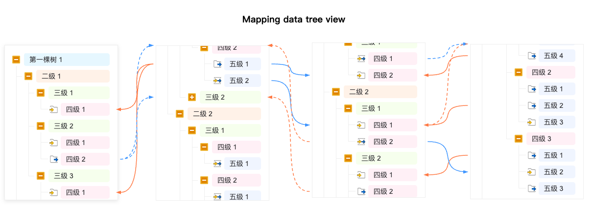

# MDF-Tree-View

[](https://www.npmjs.com/package/@clq/mdf-tree-view)
[](https://opensource.org/licenses/MIT)

MDF-Tree-View (Mapping Data Flow Tree View) 是一个强大的可视化工具，用于展示多棵树形结构数据并在它们之间创建连接线，直观地展示数据流动和关联关系。

## 特性

- **多树视图**：同时展示多棵树结构数据
- **灵活连接**：支持在不同树之间的节点创建双向连接线
- **拖拽交互**：可拖拽树容器调整位置
- **节点交互**：支持节点展开/折叠
- **智能连线**：即使节点在视野外也能正确显示连接关系
- **自定义样式**：丰富的配置选项，支持自定义连接线样式和节点样式
- **事件回调**：提供丰富的事件回调函数，方便集成到各类应用中
- **TypeScript支持**：完整的TypeScript类型定义

## 预览



## 安装

### NPM

```bash
npm install @clq/mdf-tree-view --save
```

### Yarn

```bash
yarn add @clq/mdf-tree-view
```

## 快速开始

### 引入资源

```javascript
import MappingTreeFlow from '@clq/mdf-tree-view';
import '@clq/mdf-tree-view/dist/index.css';
```

### HTML结构

```html
<div id="tree-container"></div>
```

### 初始化组件

```javascript
// 准备树数据
const trees = [
  {
    id: 'tree1',
    data: [
      {
        id: 'node1',
        label: '节点1',
        level: 1,
        type: 'folder',
        children: [
          {
            id: 'node1-1',
            label: '子节点1-1',
            level: 2,
            type: 'input'
          }
        ]
      }
    ]
  },
  {
    id: 'tree2',
    data: [
      {
        id: 'node2',
        label: '节点2',
        level: 1,
        type: 'folder',
        children: [
          {
            id: 'node2-1',
            label: '子节点2-1',
            level: 2,
            type: 'output'
          }
        ]
      }
    ]
  }
];

// 准备连接线数据
const linkList = [
  {
    source: 'node1-1',
    target: 'node2-1',
    id: 'connection-1'
  }
];

// 初始化组件
const mappingTreeFlow = new MappingTreeFlow('tree-container', trees, linkList, {
  bezier: 80,
  enableLink: true,
  enableTxtBgColor: true,
  enableDraggable: true,
  onConnectionsChange: (connections) => {
    console.log('Connections changed:', connections);
  }
});
```

## API文档

### 类: MappingTreeFlow

主要类，用于创建和管理多树视图。

#### 构造函数

```typescript
constructor(containerId: string, trees: TreeConfig[], linkList: Connection[], options?: MappingTreeFlowOptions)
```

- **containerId**: 容器元素的ID
- **trees**: 树配置数组
- **linkList**: 连接线数组
- **options**: 配置选项

#### 公共方法

##### redraw()

重新绘制所有连接线。

```typescript
public redraw(): void
```

##### updateData(trees, linkList)

更新树数据和连接线数据。

```typescript
public updateData(trees: TreeConfig[], linkList: Connection[]): void
```

- **trees**: 新的树配置数组
- **linkList**: 新的连接线数组

##### getConnections()

获取当前所有连接线。

```typescript
public getConnections(): Connection[]
```

返回值：当前所有连接线的数组

##### removeConnection(connection)

删除指定的连接线。

```typescript
public removeConnection(connection: Connection): boolean
```

- **connection**: 要删除的连接线对象

返回值：是否成功删除

##### updateConnection(updatedConnection)

更新指定的连接线数据。

```typescript
public updateConnection(updatedConnection: Connection): void
```

- **updatedConnection**: 更新后的连接线对象，必须包含id

### 接口定义

#### NodeType

节点类型枚举

```typescript
export type NodeType = 'input' | 'output' | 'inOut' | 'folder';
```

#### TreeNode

树节点接口

```typescript
export interface TreeNode {
  id: string;          // 节点唯一标识
  label: string;       // 节点标签
  level: number;       // 节点层级
  type: NodeType;      // 节点类型
  icon?: string;       // 节点图标
  children?: TreeNode[]; // 子节点
  parentId?: string;   // 父节点ID
  [key: string]: any;  // 其他自定义属性
}
```

#### Connection

连接线接口

```typescript
export interface Connection {
  source: string;      // 源节点ID
  target: string;      // 目标节点ID
  id?: string;         // 连接唯一标识
  [key: string]: any;  // 其他自定义属性
}
```

#### TreeConfig

树配置接口

```typescript
export interface TreeConfig {
  id: string;          // 树唯一标识
  data: TreeNode[];    // 树节点数据
  width?: number;      // 树容器宽度
  height?: number;     // 树容器高度
}
```

#### MappingTreeFlowOptions

配置选项接口

```typescript
export interface MappingTreeFlowOptions {
  bezier?: number;                         // 贝塞尔曲线参数，默认70
  enableLink?: boolean;                    // 是否启用连接功能，默认true
  enableTxtBgColor?: boolean;              // 是否启用文本背景色，默认false
  enableDraggable?: boolean;               // 是否启用拖拽功能，默认true
  onConnectionsChange?: (connections: Connection[]) => void; // 连接列表变化时的回调
  onConnectionChange?: (connection: Connection, type: 'add' | 'remove') => void; // 单个连接变化时的回调
  onUpdateConnection?: (connection: Connection) => void; // 更新连接时的回调
  minTreeDistance?: number;                // 树之间的最小距离，默认100px
}
```

## 高级用法

### 事件回调

```javascript
const mappingTreeFlow = new MappingTreeFlow('tree-container', trees, linkList, {
  // 当连接列表发生变化时触发
  onConnectionsChange: (connections) => {
    console.log('当前所有连接:', connections);
    // 这里可以保存连接数据到服务器
  },
  
  // 当单个连接添加或删除时触发
  onConnectionChange: (connection, type) => {
    console.log(`${type}连接:`, connection);
  },
  
  // 当连接更新时触发
  onUpdateConnection: (connection) => {
    console.log('更新连接:', connection);
  }
});
```

### 动态更新数据

```javascript
// 更新树数据
const newTrees = [/* 新的树数据 */];
const newLinks = [/* 新的连接线数据 */];
mappingTreeFlow.updateData(newTrees, newLinks);

// 获取当前连接
const currentConnections = mappingTreeFlow.getConnections();

// 删除指定连接
const connectionToRemove = currentConnections[0];
mappingTreeFlow.removeConnection(connectionToRemove);

// 更新连接
const updatedConnection = {
  id: 'connection-1',
  source: 'new-source',
  target: 'new-target',
  customProperty: 'updated-value'
};
mappingTreeFlow.updateConnection(updatedConnection);
```

## 使用示例

### 基础示例

```javascript
import MappingTreeFlow from '@clq/mdf-tree-view';
import '@clq/mdf-tree-view/dist/index.css';

// 准备树数据
const trees = [
  {
    id: 'leftTree',
    data: [
      {
        id: 'left-1',
        label: '左侧根节点1',
        level: 1,
        type: 'folder',
        children: [
          {
            id: 'left-1-1',
            label: '左侧子节点1-1',
            level: 2,
            type: 'input'
          },
          {
            id: 'left-1-2',
            label: '左侧子节点1-2',
            level: 2,
            type: 'output'
          }
        ]
      }
    ]
  },
  {
    id: 'rightTree',
    data: [
      {
        id: 'right-1',
        label: '右侧根节点1',
        level: 1,
        type: 'folder',
        children: [
          {
            id: 'right-1-1',
            label: '右侧子节点1-1',
            level: 2,
            type: 'inOut'
          }
        ]
      }
    ]
  }
];

// 创建实例
const mtf = new MappingTreeFlow('container', trees, [], {
  bezier: 100,
  enableLink: true,
  enableDraggable: true
});

// 添加自定义样式
const style = document.createElement('style');
style.textContent = `
  .tree-node .tree-label {
    transition: all 0.2s;
  }
  .tree-node .tree-label:hover {
    background-color: #f0f7ff;
  }
`;
document.head.appendChild(style);
```

### 复杂数据示例

您可以使用项目提供的mockData.js生成复杂的树形数据和连接线数据：

```javascript
import MappingTreeFlow from '@clq/mdf-tree-view';
import '@clq/mdf-tree-view/dist/index.css';
import { multiTreeData, multiLnkList } from './mockData.js';

// 转换mock数据为TreeConfig格式
const trees = Object.entries(multiTreeData).map(([key, value]) => ({
  id: key,
  data: value
}));

// 创建实例
const mtf = new MappingTreeFlow('container', trees, multiLnkList, {
  bezier: 120,
  enableLink: true,
  enableTxtBgColor: true,
  enableDraggable: true,
  minTreeDistance: 150
});
```

## 自定义样式

您可以通过覆盖CSS变量或自定义CSS来修改组件的外观：

```css
/* 自定义树节点样式 */
.tree-node .tree-label {
  font-size: 14px;
  color: #333;
}

/* 自定义连接线样式 */
#connection-layer path {
  transition: all 0.3s ease;
}

/* 自定义树容器样式 */
.tree-container {
  background-color: #fafafa;
  border: 1px solid #e8e8e8;
  border-radius: 6px;
}
```

## 浏览器兼容性

- Chrome (推荐)
- Firefox
- Safari
- Edge

## 贡献指南

如果您想为这个项目做贡献，请按照以下步骤：

1. Fork 项目仓库
2. 创建您的特性分支 (`git checkout -b feature/AmazingFeature`)
3. 提交您的更改 (`git commit -m 'Add some AmazingFeature'`)
4. 推送到分支 (`git push origin feature/AmazingFeature`)
5. 开启一个 Pull Request

## 许可证

本项目使用 MIT 许可证 - 详见 [LICENSE](LICENSE) 文件

## 致谢

感谢所有为这个项目做出贡献的开发者！

## 作者

calvinlq

- Email: [calvinlq@163.com](mailto:calvinlq@163.com)